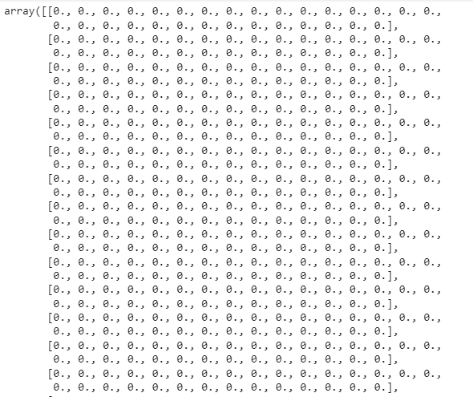
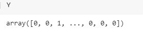
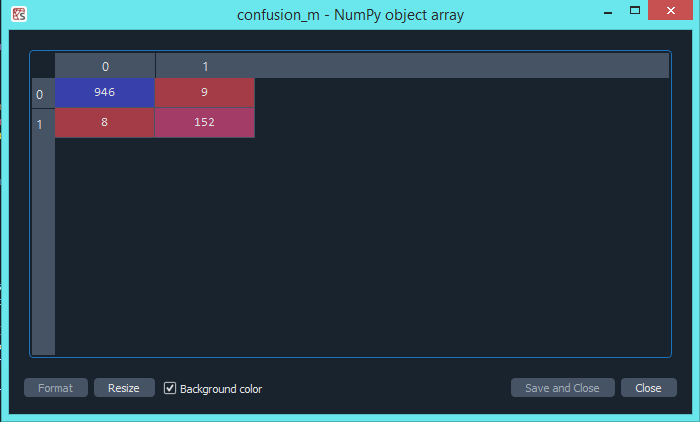
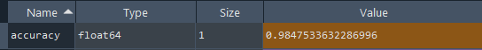

# Spam_Classifier_Project

A **spam classifier** using **Natural Language Processing** (NLP) is a machine learning model designed to automatically categorize and filter out unwanted or irrelevant messages, typically in the context of emails or text messages. It analyzes the content of messages and applies NLP techniques to distinguish between legitimate and spam messages based on various features, such as the presence of specific keywords, patterns, or text characteristics. NLP-based spam classifiers use text processing and statistical methods to classify incoming messages as either spam or not spam.
 
 ## Table of Contents
- [Introduction](#introduction)
- [Getting Started](#getting-started)
- [Prerequisites](#prerequisites)
- [Code Description](#code-description)
- [Usage](#usage)
- [Screenshots](#screenshots)
- [Packages And Libraries](#P&L)
- [Author](#author)

## Introduction <a name="introduction"></a>

This program is designed to classify SMS messages into two categories: spam and ham. It processes the text messages using various techniques, such as data cleaning, preprocessing, and the Bag of Words model. The Naive Bayes classifier is used for making the final classification decision.


## Getting Started <a name="getting-started"></a>

These instructions will help you get a copy of the project up and running on your local machine for testing and development purposes.


## Prerequisites <a name="prerequisites"></a>

Before you begin, ensure you have met the following requirements:

- Having an understanding of Lemmatization, Stemming, Stop words, Bag of words, Naive Bayes Classifier
- Dataset Link (https://archive.ics.uci.edu/dataset/228/sms+spam+collection)
- Python (>=3.0)
- Python libraries: pandas, nltk, sklearn

You can install the required libraries using pip:

```bash
pip install pandas nltk scikit-learn
```

## Code Description <a name="code-description"></a>
The code is structured into several main sections:

1. Importing the Dataset: Reads the SMS dataset using Pandas.

2. Data Cleaning and Preprocessing: Cleans and preprocesses the text data, including removing non-alphabetic characters, converting to lowercase, and applying stemming and stopword removal.

3. Creating the Bag of Words Model: Utilizes the CountVectorizer from scikit-learn to convert the text data into numerical features.

4. Train-Test Split: Splits the dataset into a training set and a testing set for model evaluation.

5. Training the Naive Bayes Classifier: Utilizes a Multinomial Naive Bayes classifier to train the spam detection model.

6. valuating the Model: Calculates and displays the confusion matrix and accuracy score for model performance evaluation.

7. Creating the Streamlit App: Generates the [Colab+pycharm_code\app.py](app.py) file using the Streamlit library to create a user-friendly web application for spam detection.

## Usage <a name="usage"></a>
You can use this code as a starting point for SMS spam classification. To use the program, follow these steps:

1. Install the prerequisites.
2. Ensure you have a dataset with SMS messages and labels.
3. Modify the file path to your dataset in the code.

Run the code to train and evaluate the SMS spam classifier.

## Screenshots <a name="screenshots"></a>

1. Dataset Frame


2. After Data Cleaning


3. Difference between Actual DataSet And Cleaning Dataset


4. Bag Of Words(X)
.PNG>)

5. Tf-idf(X)


6. (Y) Array of 0's & 1's of label('spam''ham')


7. X(independent variable) & y(dependent variable)


8. Confusion Matrix


9. Accuracy Score


10. Final Outcome

## Packages And Libraries <a name="P&L"></a>
-   `pandas`
-   `re`
-   `nltk`
-   `Scikit-learn`
-   `Streamlit`
-   `pickle`

## Author <a name="author"></a>

This Model is developed by Ayush Verma.